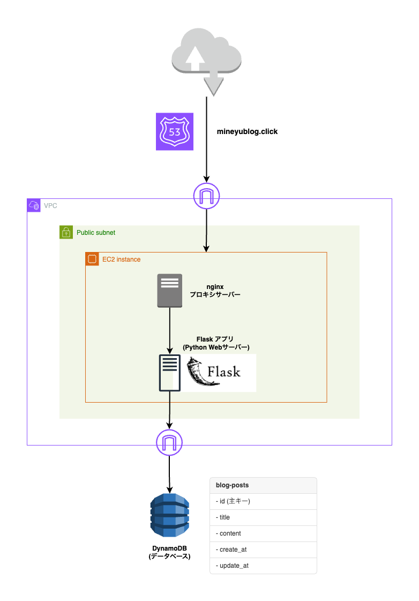

# AWS-Blog-App

URL: [mineyublog.click](https://www.mineyublog.click)

フルスタックブログアプリケーション。AWS上でCRUD機能を用意し、独自のドメインでHTTPS対応したWebアプリです。


## 特徴

- **CRUD操作** - 記事の作成、読み取り、更新、削除
- **HTTPS対応** - Let's Encrypt SSL証明書を使用
- **レスポンシブデザイン** - Bootstrap 5を使用し簡易的に実装
- **クラウドネイティブ** - AWS フルマネージド
- **コスト最適化** - AWS無料利用枠内で運用

### フロントエンド機能

- **記事作成** - タイトルと本文入力
- **記事一覧** - カード形式での表示
- **記事編集** - インライン編集
- **記事削除** - 確認ダイアログ付き

## アーキテクチャ

```
インターネット
    ↓
Route 53 (DNS)
    ↓
EC2 (nginx + Flask)
    ↓
DynamoDB (NoSQL)
```
<!--  -->

<a>
  
</a>

### 技術スタック

| 層 | 技術 | 説明 |
|---|------|------|
| **フロントエンド** | HTML, JavaScript, Bootstrap | レスポンシブデザイン |
| **バックエンド** | Python Flask | 簡易的に実装 |
| **Webサーバー** | nginx | リバースプロキシ、SSL |
| **データベース** | AWS DynamoDB | NoSQLデータベース |
| **インフラ** | AWS EC2, Route 53 | クラウドサービス |
| **SSL証明書** | Let's Encrypt | 無料SSL/TLS証明書 |

## 📁 プロジェクト構造

```
aws-blog-app/
├── app/
│   ├── app.py              # Flaskアプリケーション
│   ├── static/
│   │   ├── css/
│   │   │   └── style.css   # カスタムスタイル
│   │   └── js/
│   │       └── main.js     # フロントエンドロジック
│   └── templates/
│       └── index.html      # メインテンプレート
├── nginx.conf              # nginx設定ファイル
├── requirements.txt        # Python依存関係
├── deploy.sh              # デプロイスクリプト
├── docs/                  # ドキュメント
└── README.md
```


## コスト

### AWS料金（月額）

| サービス | 無料枠期間 | 無料枠後 |
|---------|-----------|---------|
| EC2 t2.micro | $0 | ~$8.50 |
| DynamoDB | $0 | $0 |
| Route 53 | $0.50 | $0.50 |
| **合計** | **$0.50** | **~$9.00** |

### コスト最適化

- スケジュール停止により費用削減が可能。
- 無料利用枠の最大活用

## 未実装
- スケールイン、スケールアウトによるパフォーマンス向上
- リレーショナルデータベースへの対応
- スケジュール停止